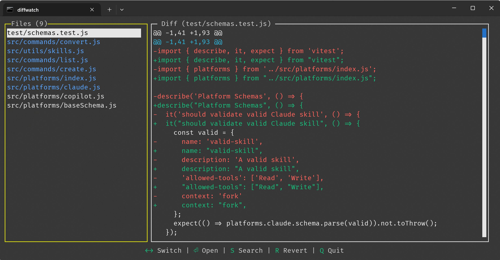

[](https://www.npmjs.com/package/diffwatch)

# DiffWatch

A TUI app for watching git repository file changes with diffs. 

**Handy for when you want to know what the AI agents are cooking.**



## Features

- **File Status Tracking**: Shows all changed files in a Git repository with their status (modified, new, deleted, renamed, etc.)
- **Visual Diff Viewer**: Displays differences between file versions with syntax highlighting and line-by-line comparison
- **File Operations**: 
  - Revert changes to files
  - Delete files safely (with trash/recycle bin support)
  - Open files in the default editor
- **Search Functionality**: Allows searching for files by content within the repository
- **Commit History Browser**: View commit history with hash, message, author, and date

## Installation

### Option 1: Install from npm (recommended)

```bash
npm install -g diffwatch
```

Then run from any git repository:
```bash
diffwatch
```

### Option 2: Install from source

1. Clone the repository:
```bash
git clone https://github.com/sarfraznawaz2005/diffwatch.git
cd diffwatch
```

2. Install dependencies:
```bash
bun install
```

## Usage

To watch the current git repository:
```bash
diffwatch
```

To watch a specific git repository:
```bash
diffwatch --path|-p /path/to/repo
```

### Command Line Options

```bash
diffwatch [OPTIONS]
```

**Options:**
- `--path <path>` or `-p <path>` - Specify git repository path to watch
- `--help` or `-h` - Show help message
- `--version` or `-v` - Show version number

## Keyboard Shortcuts

- `↑` / `↓` - Navigate through the file list
- `Tab` / `←` / `→` - Switch between file list and diff view
- `Enter` - Open selected file in default editor
- `D` - Delete selected file
- `R` - Revert changes to selected file
- `S` - Enter search mode
- `H` - View commit history
- `Q` - Quit the application
- `Esc` - Exit search mode or close dialogs

### Running the App in Development

```bash
bun run dev
# or
bun run start
```

### Building

To build the application for distribution:
```bash
bun run build
```

This creates a compiled binary in `dist/` directory.

### Running Tests

```bash
bun test                    # Run all tests
bun test:watch            # Run tests in watch mode
bun test:coverage         # Run tests with coverage
bun test:unit            # Run unit tests only
bun test:integration     # Run integration tests only
bun test:git            # Run git-related tests only
bun test:components     # Run component tests only
bun test:app           # Run app integration tests
```

### Type Checking

```bash
bun run typecheck
# or
bun run lint
```

## License

[MIT](LICENSE)

## GUI Alternative

[Diffy](https://github.com/sarfraznawaz2005/diffy)
