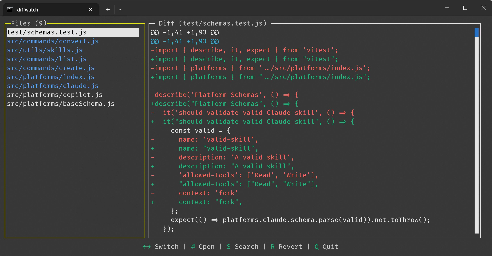

# diffwatch

A CLI-based Node.js application that provides a real-time Terminal User Interface (TUI) for monitoring Git repository changes. Watch file statuses and view diffs in a split-pane interface without leaving your terminal.



## Features

- **Real-time Monitoring**: Automatically refreshes every 5 seconds to show the latest Git status
- **Split-pane TUI**: Left pane displays files with color-coded status, right pane shows unified diffs
- **Color-coded Status**: Green for added, Red for deleted, Blue for modified, White for untracked
- **Keyboard Navigation**: Use arrow keys to navigate files, Tab to switch panes
- **Git-only Operation**: Works exclusively in Git repositories
- **Cross-platform**: Built with Node.js and TypeScript

## Installation

### Global Installation (Recommended)

```bash
npm install -g diffwatch
```

### Local Installation

```bash
git clone <repository-url>
cd diffwatch
npm install
npm run build
npm link
```

## Usage

Navigate to any Git repository and run:

```bash
diffwatch [path] [options]
```

### Arguments

- `path`: Path to the git repository (default: current directory)

### Options

- `-h, --help`: Show help information

The application will:
1. Check if the current directory is a Git repository
2. Display a TUI with two panes
3. Automatically refresh every 5 seconds

### Controls

- **Arrow Keys / Tab**: Navigate through the file list and scroll in diff pane
- **Enter**: Open selected file in default editor
- **Escape/Q/Ctrl+C**: Exit the application

## Prerequisites

- Node.js 16 or higher
- Git installed and accessible in PATH
- A terminal that supports TUI applications (most modern terminals)

## Development

### Setup

```bash
npm install
npm run build
npm run dev  # Run in development mode
npm test     # Run tests
```

### Project Structure

```
src/
├── index.ts          # Main application entry point
└── utils/
    └── git.ts        # Git operations and status handling
tests/
├── git.test.ts       # Unit tests for GitHandler
```

### Building

```bash
npm run build  # Compile TypeScript to JavaScript
```

### Testing

```bash
npm test  # Run Jest test suite
```

